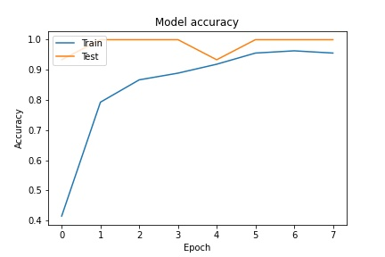
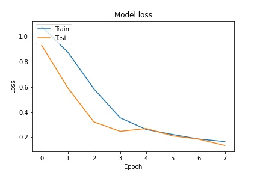

# Iris Species Classification

### A comparitive study between Decision Trees and ANN to classify Iris Species.

## Libraries Required 
1. Decision Tree Classifier
    * python 3.8.2
    * numpy 1.18.3
    * pandas 1.0.3
    * scikit-learn 0.22.2

2. Artificial Neural Network
    * python 3.8.2
    * numpy 1.18.3
    * pandas 1.0.3
    * matplotlib 3.2.1
    * scikit-learn 0.22.2
    * tensorflow 2.2.0

## Dataset 
 The dataset is taken from [Kaggle.]([&lt;TextView&gt;](http://example.com))

A copy is also included in the project files.

## Running the code
### 1. Decision Tree
The file classification.py uses a Decision Tree to classify the flowers into the iris species based on certain features.

### 2. Artificial Neural Network
The model.ipynb file is the complete code for the neural network from the pre-processing to the training and testing of the model. Run each code block in the order written to ensure proper execution. Hyperparameters can be tuned to improve model performance.

## ANN Model Performance
1. 

2. 

## Extra
Using CUDA to run the model on the GPU instead of the CPU to increase computation efficiency.